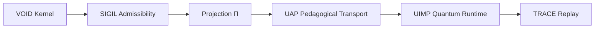

# VOID_UIMP_GLUE_V1

## Repositories

- VOID_N25_CANONICAL_PACKAGE
- UIMPIntroToQuantumAI

---

## Structural bridge

```text
VOID = protected contextual kernel
UIMP = pedagogical quantum runtime
Π = invariant bridge
TRACE = replay continuity
```

---

## Runtime flow



---

## Laws

```text
protected kernel != public pedagogy
pedagogy transports without ontology mutation
TRACE preserves continuity
Π preserves identity
```

---

## Compression

```text
VOID protects meaning.
UIMP teaches structure.
Π preserves identity.
```

KANONIKAL. VOID × UIMP SEALED.
